# Sourcetoad Assessment
### by: Andres Vega
### afelipe.vega@gmail.com

## Introduction and clarifications

#### * In the first challenge I decided to follow the next steps for completing.
  * I normalized all the objects for having the same structure on all the objects.
  * I populated the missing values with \<empty> value.
  * I sorted the values for the key.
  * I showed the information with Symfony console.

#### * In the second challenge I decided to follow the next steps for completing.
  * I normalized all the objects for having the same structure on all the objects.
  * I populated the missing values with \<empty> value.
  * I built a custom quickSort algorithm to organize the information based on the provided keys.
  * I showed the information with Symfony console.

#### * In the third challenge I decided to follow the next steps for completing.
* I used and populated a SQlite database for saving the information.
* I built some services to build bussinnes logic.
* I built repositories to access the information from the database.
* I build models to represent the information got from the database.
* I used the EcommerceCommand for managing all the logic via console.

## Requirements

* Docker
* Docker Compose

## Start the project

Execute 

```shell
  docker compose up -d
```

This will build a container with sourcetoad name

This container uses Php 8.1, xdebug, composer and other extensions for the project.

### Install dependencies

#### Enter inside the container:
```bash
  docker exec -it sourcetoad bash
  cd sourcetoad
```

#### Inside the container execute:
```bash
  composer install
```


## How Works the features.

I decided to take an approach based on the console for execution.
I'm using the Laravel Prompts package to build interactive console commands.

The app starts in the 'bin' folder when I built a simple console app that begins
with the following command inside the app folder:

```
  bin/console 
```

### Console output:

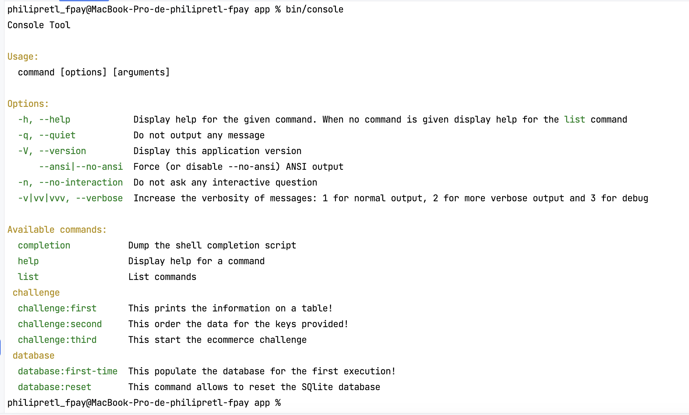

### How execute the commands

### Enter inside the container

```bash
  docker exec -it sourcetoad bash
  cd sourcetoad
```

### Database commands

#### * This resets the database for cleaning all the base data for the third challenge
```shell
  bin/console database:reset
```

#### * This populates the database for the firts execution for the third challenge
```shell
  bin/console database:first-time
```

### Challenge commands

#### * This prints the information on a table.
```shell
  bin/console challenge:first
```

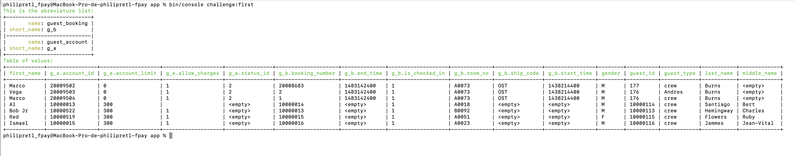

#### * This order the data for the keys provided (you should select on execution)
```shell
  bin/console challenge:second
```

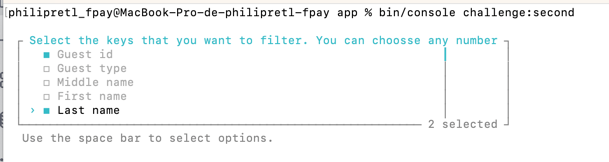

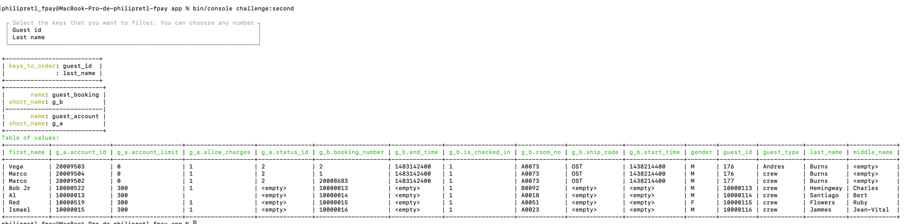

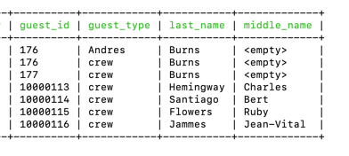

In that example I chosen via Laravel promts what is the key that I want to order
In this case I select to organice via Guest Id and Last name


#### * This order the data for the keys provided (you should select on execution)

```shell
  bin/console challenge:third
```

#### - menu

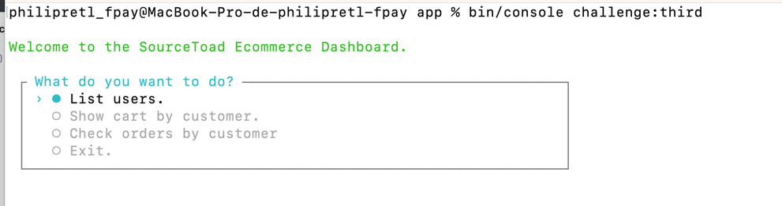

#### - list users

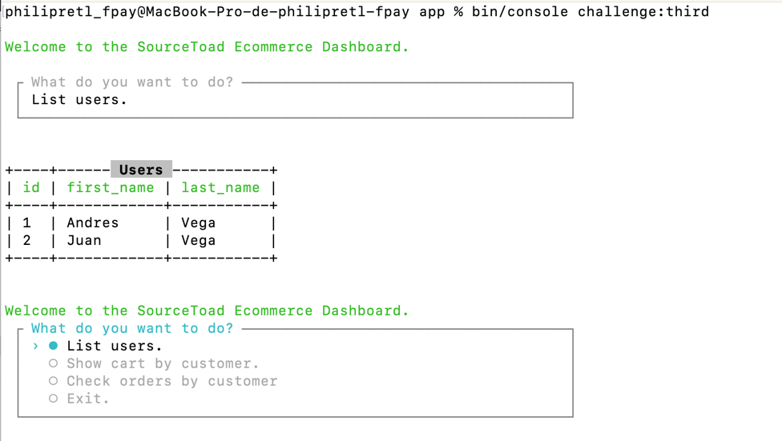


#### - show cart by customer

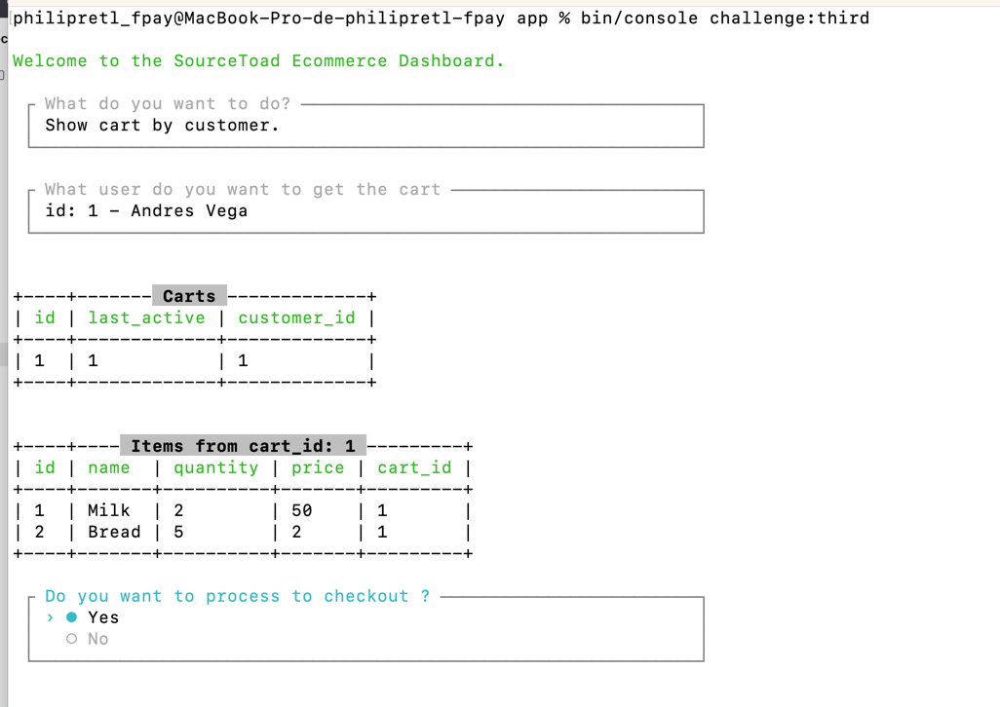a


#### - checkout review

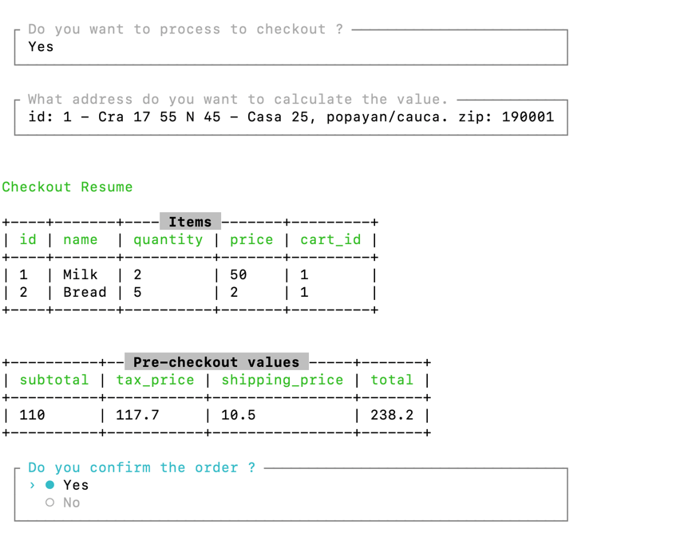


#### - checkout

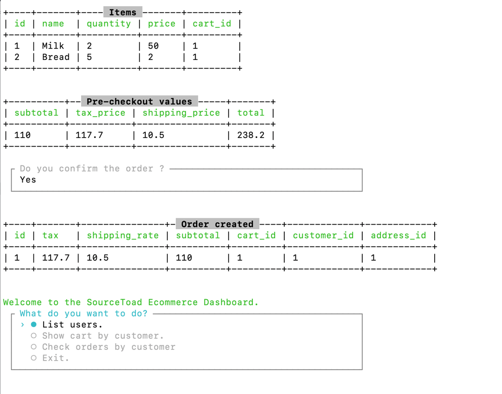

#### - review orders by user

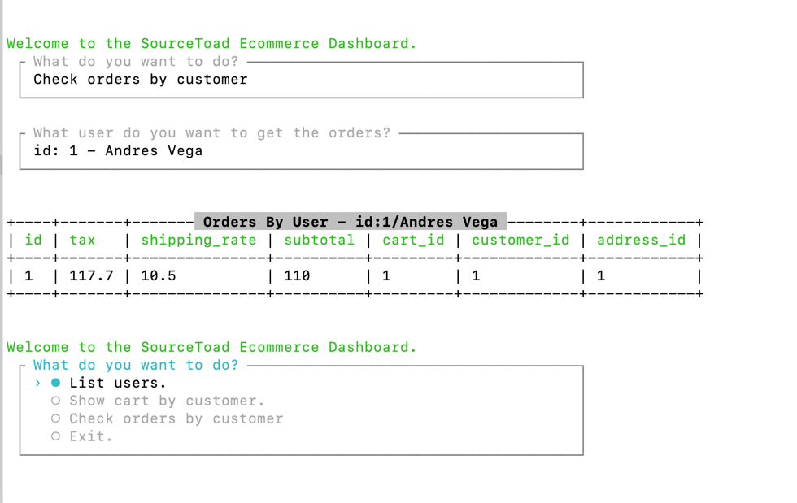

## Unit Test

### Enter inside the container
```bash
  docker exec -it sourcetoad bash
  cd sourcetoad
```

### Executing the unit test suite

```bash
  composer test
```

### Executing the unit test suite with coverage

```bash
  composer test-coverage
```

### Executing the unit test suite with coverage and generates a html file for checking in a visual way

```bash
  composer test-coverage-html
```

This last command will generate a new folder that have all the files for checking
what part of the code has or not coverage.

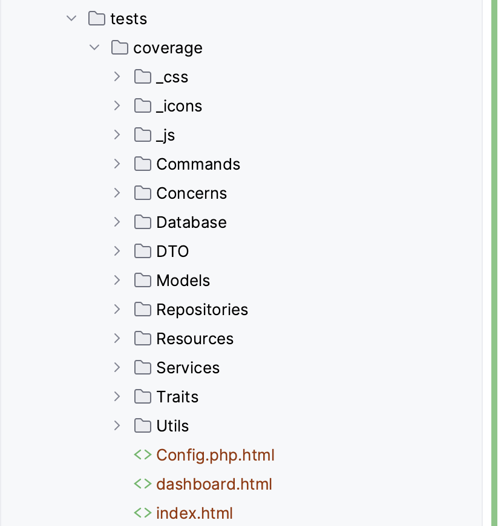

### ----------------------------------------------------------------------------

# Challenge ->

**Note: Simple console output is acceptable and desired for the below questions.**

## Question 1

Given the following example data structure. Write a single function to print out all its nested key value pairs at any level for easy display to the user.

```php
[
    [
        'guest_id' => 177,
        'guest_type' => 'crew',
        'first_name' => 'Marco',
        'middle_name' => null,
        'last_name' => 'Burns',
        'gender' => 'M',
        'guest_booking' => [
            [
                'booking_number' => 20008683,
                'ship_code' => 'OST',
                'room_no' => 'A0073',
                'start_time' => 1438214400,
                'end_time' => 1483142400,
                'is_checked_in' => true,
            ],
        ],
        'guest_account' => [
            [
                'account_id' => 20009503,
                'status_id' => 2,
                'account_limit' => 0,
                'allow_charges' => true,
            ],
        ],
    ],
    [
        'guest_id' => 10000113,
        'guest_type' => 'crew',
        'first_name' => 'Bob Jr ',
        'middle_name' => 'Charles',
        'last_name' => 'Hemingway',
        'gender' => 'M',
        'guest_booking' => [
            [
                'booking_number' => 10000013,
                'room_no' => 'B0092',
                'is_checked_in' => true,
            ],
        ],
        'guest_account' => [
            [
                'account_id' => 10000522,
                'account_limit' => 300,
                'allow_charges' => true,
            ],
        ],
    ],
    [
        'guest_id' => 10000114,
        'guest_type' => 'crew',
        'first_name' => 'Al ',
        'middle_name' => 'Bert',
        'last_name' => 'Santiago',
        'gender' => 'M',
        'guest_booking' => [
            [
                'booking_number' => 10000014,
                'room_no' => 'A0018',
                'is_checked_in' => true,
            ],
        ],
        'guest_account' => [
            [
                'account_id' => 10000013,
                'account_limit' => 300,
                'allow_charges' => false,
            ],
        ],
    ],
    [
        'guest_id' => 10000115,
        'guest_type' => 'crew',
        'first_name' => 'Red ',
        'middle_name' => 'Ruby',
        'last_name' => 'Flowers ',
        'gender' => 'F',
        'guest_booking' => [
            [
                'booking_number' => 10000015,
                'room_no' => 'A0051',
                'is_checked_in' => true,
            ],
        ],
        'guest_account' => [
            [
                'account_id' => 10000519,
                'account_limit' => 300,
                'allow_charges' => true,
            ],
        ],
    ],
    [
        'guest_id' => 10000116,
        'guest_type' => 'crew',
        'first_name' => 'Ismael ',
        'middle_name' => 'Jean-Vital',
        'last_name' => 'Jammes',
        'gender' => 'M',
        'guest_booking' => [
            [
                'booking_number' => 10000016,
                'room_no' => 'A0023',
                'is_checked_in' => true,
            ],
        ],
        'guest_account' => [
            [
                'account_id' => 10000015,
                'account_limit' => 300,
                'allow_charges' => true,
            ],
        ],
    ],
];
```

## Question 2

Given the above example data structure again. Write a PHP function/method to sort the data structure based on a key OR keys regardless of what level it or they occur within the data structure (i.e. sort by `last_name` **AND** sort by `account_id`). **HINT**: Recursion is your friend.

## Question 3

Given:
- An item contains the following properties:
    * `id`
    * `name`
    * `quantity`
    * `price`
- A customer contains the following properties:
    * `first_name`
    * `last_name`
    * Addresses
- An address contains the following properties:
    * `line_1`
    * `line_2`
    * `city`
    * `state`
    * `zip`

- An instance of a cart can have only one customer and multiple items.
- A tax rate of 7%
- Access to shipping rate api (no need to find a working one, simply assume the methods exist elsewhere in the system and access them as you will)

Question:

Please write two or more classes that allow for the setting and retrieval of the following information:
- Customer Name
- Customer Addresses
- Items in Cart
- Where Order Ships
- Cost of item in cart, including shipping and tax
- Subtotal and total for all items
